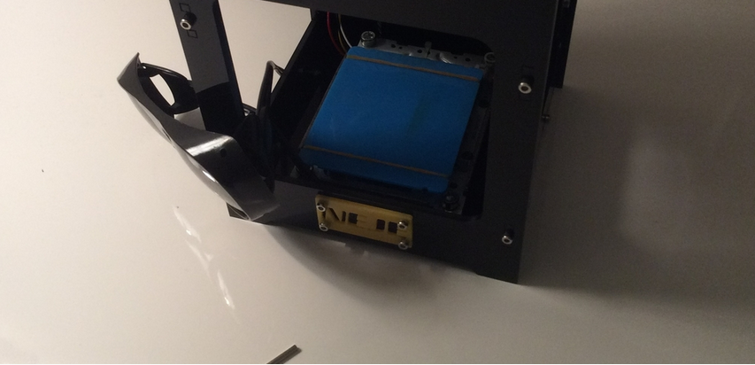
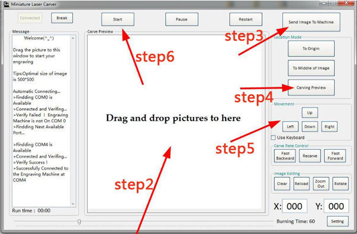

When I first opened the Neje DK-8 Pro-5 Laser Engraver out of it's packaging, my first impressions were of how premium the whole package looked and felt. Made by Neje (an obscure Chinese company) and sold by Gearbest.com, you can buy one for 79.99 here: http://goo.gl/b2Ig8H.

_The Neje DK-8 Pro-5 500mW Laser Engraver I received_

Inside the box I received the laser engraver, the power cord, the data cable, Allen Wrench and the safety glasses. The laser engraver did come with a power brick, but I opted to plug it into my computer to save an outlet slot. The data cable is your standard Micro USB, whereas it is a bit shorter than I would have liked, it does the job just fine. The Allen Wrench was included to tighten any loose parts, although after using it for 3 days I haven't found a need for it. The laser itself is a Violet 500mW diode, which (if looked at directly) would blind you. The safety glasses were included mainly for the purpose of focusing the laser (which I haven't needed to do), but I've worn them during use as the laser is quite powerful. However, the reflection alone would not be enough to blind you.

Contents:

Inside the box I received the laser engraver, the power cord, the data cable, Allen Wrench and the safety glasses. The laser engraver did come with a power brick, but I opted to plug it into my computer to save an outlet slot. The data cable is your standard Micro USB, whereas it is a bit shorter than I would have liked, it does the job just fine. The Allen Wrench was included to tighten any loose parts, although after using it for 3 days I haven't found a need for it. The laser itself is a Violet 500mW diode, which (if looked at directly) would blind you. The safety glasses were included mainly for the purpose of focusing the laser (which I haven't needed to do), but I've worn them during use as the laser is quite powerful. However, the reflection alone would not be enough to blind you.

Software:

The software is made by another obscure Chinese company called Trusfer. It is extremely easy to use, and can translate color photo's into black-and-white engravable ones. It has options to move the laser on the print bed, which can prove useful to make minor positional changes before carving. It also has the option to initiate a Carving Preview, which is especially useful to see where you are going to carve before you do so. In addition to those features, it also gives you the ability to stop in the middle of a print (if you need to adjust something) and then pick up exactly where you left off.

_Image taken from http://www.trusfer.com/#Download _
effef
