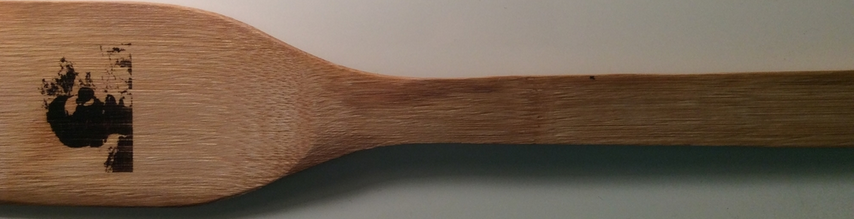

When I first opened the Neje DK-8 Pro-5 Laser Engraver out of it's packaging, my first impressions were of how premium the whole package looked and felt. Made by Neje (an obscure Chinese company) and sold by Gearbest.com, you can buy one for 79.99 here: http://goo.gl/b2Ig8H.

_The Neje DK-8 Pro-5 500mW Laser Engraver I received._

Inside the box I received the laser engraver, the power cord, the data cable, Allen Wrench and the safety glasses. The laser engraver did come with a power brick, but I opted to plug it into my computer to save an outlet slot. The data cable is your standard Micro USB, whereas it is a bit shorter than I would have liked, it does the job just fine. The Allen Wrench was included to tighten any loose parts, although after using it for 3 days I haven't found a need for it. The laser itself is a Violet 500mW diode, which (if looked at directly) would blind you. The safety glasses were included mainly for the purpose of focusing the laser (which I haven't needed to do), but I've worn them during use as the laser is quite powerful. However, the reflection alone would not be enough to blind you.

Contents:

Inside the box I received the laser engraver, the power cord, the data cable, Allen Wrench and the safety glasses. The laser engraver did come with a power brick, but I opted to plug it into my computer to save an outlet slot. The data cable is your standard Micro USB, whereas it is a bit shorter than I would have liked, it does the job just fine. The Allen Wrench was included to tighten any loose parts, although after using it for 3 days I haven't found a need for it. The laser itself is a Violet 500mW diode, which (if looked at directly) would blind you. The safety glasses were included mainly for the purpose of focusing the laser (which I haven't needed to do), but I've worn them during use as the laser is quite powerful. However, the reflection alone would not be enough to blind you.

Software:

The software is made by another obscure Chinese company called Trusfer. It is extremely easy to use, and can translate color photo's into black-and-white engravable ones. It has options to move the laser on the print bed, which can prove useful to make minor positional changes before carving. It also has the option to initiate a Carving Preview, which is especially useful to see where you are going to carve before you do so. In addition to those features, it also gives you the ability to stop in the middle of a print (if you need to adjust something) and then pick up exactly where you left off.

_Image taken from http://www.trusfer.com/#Download ._

Let me start off with how premium the entire package feels, as though it should cost much more than $79.99. In terms of ease of use, this product is a 10/10. It took me less than 5 minutes to set up, which was surprising as I expected to spend much longer setting it up. The quality of the prints was also surprising, being much more precise and high quality than I anticipated. I went out to my local craft store, and bought some leather bracelets to test out the printer, and I can't say I wasn't impressed. The quality was good, and it was simple to carve the bracelets. To show how intricate the designs can be, I engraved my face into a spatula.

_A Jackdm.com Engraved bracelet._

_A Yin-&-Yang engraved bracelet, with some minor errors in the top left corner_

_My face. On a spatula._

Cons:

To reiterate, this Laser Engraver is top-of-the-line, but that does not mean it's without flaws. The biggest problem I encountered was with the rubber bands used to hold down the engraved objects. They work fine for things that don't bend (i.e. wood, plastic, etc.) but when you put objects that bend (i.e. bracelets), you may encounter some problems. I've also found that due to the dramatic movement of the print bed, some objects which appear to be in the correct position for engraving at first glance, may not be towards the end of the print. For an example of this, see the picture of the engraved sunglasses below. I also found the Safety Glasses to be of questionable quality, but they did the job just fine.

_Jackdm.com engraved sunglasses, with a minor error in the right-hand side of the M_

Conclusion

In conclusion, this product is not for people who need to make large laser engraved prints, but if you're in the market for a small high-quality laser engraver, this is the product for you. I would also like to note that Gearbest sent this product to me for free (which is pretty cool, thanks Gearbest!) to review .
