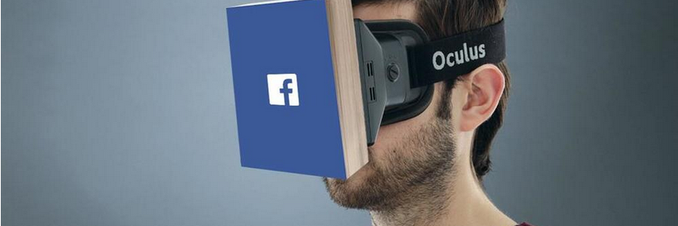

It's in the news, it's on twitter, it's everywhere and everyone's talking about it. Virtual Reality. It doesn't matter if you've heard of the Oculus Rift, the HTC Vive, or just Google Cardboard. What matters is that you've heard of it. And you're going to be hearing a lot more about it. Very recently, Oculus started shipping preorders from it's Kickstarter all the way back in 2012. Why does this matter you might be asking? Why should I care that some obscure company started shipping preorders of an obscure product? Because that obscure company was bought by Facebook. Facebook has a habit of predicting the future of technology, and the fact that they think virtual reality is going to be big, means it will be.

First, some history. In 1995 Nintendo created the Virtual Boy. It sucked. Fast forward  to 2012, and one person was changing how the world would think about entertainment. Palmer Luckey.  Luckey is the founder of Oculus, which (much akin to Apple) started in a garage. He was 17 when he created the first prototype of the Oculus Rift, and 22 when he sold his company to Facebook for 2 Billion Dollars. People were worried that Facebook was going to change Luckeys vision for VR, but (surprisingly) they didn't. 2015 was when VR came into the mainstream, with more people seeing the Developer Editions online and trying out the prototypes on the rare occasions that one left Oculus headquarters. People were finally understanding the hype. And with that understanding, the hype got bigger. Now everyone's heard of it.

If you're going to make it in this brave new (virtual) world, your going to need to know some things. Let's address the first question your undoubtedly thinking. How does it work. There are two lenses, one on each eye, which (simply put) combine into one 3d image. The quality of that image depends, however, on the quality of the headset you're using. For example, the quality of the HTC Vive is much better than that of the Google Cardboard. If you're still confused as to what VR is, put simply, it is the replication of reality through technology.

Now for the headsets. I've mentioned the Oculus Rift, the HTC Vive, and the Google Cardboard. They are all very different. The Oculus Rift is meant for people who will play mainly VR games while sitting down. The HTC Vive is meant for people who want to play more active VR games, and is made by the gaming giant Steam. Both of these require a beefy (over $1,000) computer. Google Cardboard is meant for the average consumer because you can buy it for less than twenty dollars, or even make it yourself. All you need is a smartphone. When you buy (or make) a Google Cardboard, you will have access to the plethora of apps available to you on the Google Play and iTunes stores, but there are sacrifices. Mainly the FOV, which is greatly reduced in comparison to the Rift and Vive. FOV stands for field of view, which is essentially how much of the Virtual World you will be able to see. The human eye has a FOV of approximately 180 degrees, and the HTC Vive has a FOV of 110 degrees. Google Cardboard FOV's vary, with the smallest being the View Master headset, and the largest (as of the time of posting, there are new one's popping up in the market every day) being the BoboVR Z4. All of the headsets have had many setbacks, so the official release dates (i.e. when I can get my hands on one) are kind of iffy, but you can preorder all of them if you would like (except the google cardboard, that has been available for a while). VR is here, but not entirely. Not yet, anyways.

Personally, I have tried both the Google Cardboard and the HTC Vive. The latter was an awe-inspiring experience. I highly recommend you to try it out if you get the chance, and to grab a Google Cardboard if you can so you can have a taste of what VR will be. Virtual Reality is undoubtedly the future, it's only a question of when that future will become mainstream.
